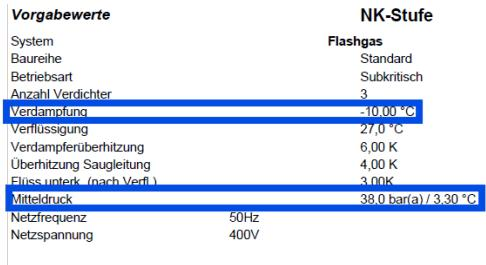
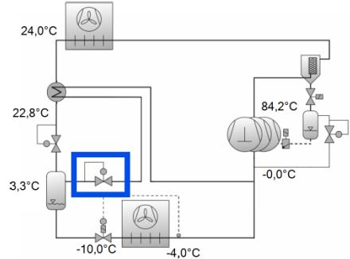
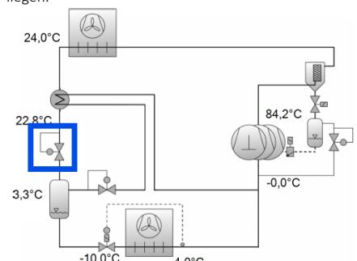

| From:        | Lötzsch, Benaja                                                                                                    |
|--------------|--------------------------------------------------------------------------------------------------------------------|
| To:          | Valentin Koch                                                                                                      |
| Cc:          | Michael Ilewicz; Winter, Simon                                                                                     |
| Subject:     | AW: Ecalia x Christof Fischer                                                                                      |
| Date:        | 26 February 2026 08:40:32                                                                                          |
| Attachments: | image001.png                                                                                                       |
|              | Image: image002.png                                                                                                |
|              | Image: image003.png                                                                                                |
|              | Image: image004.png                                                                                                |
|              | Image: image005.png                                                                                                |
|              | Image: image006.png                                                                                                |
|              | Betrieb im Winter Q0_MT 98,9; Q0_LT; to_LT -30, to_MT -10; t_gc_out 38.pdf                                         |
|              | Betrieb in der Übergangsjahreszeit Q0_MT 98,6; Q0_LT; to_LT -30, to_MT -10; t_gc_out 38.pdf                        |
|              | Betrieb in der Übergangsjahreszeit mit Parallelverdichter Q0_MT 98,6; Q0_LT; to_LT -30, to_MT -10; t_gc_out 38.pdf |
|              | Betrieb im Hochsommer Q0_MT 98,7; Q0_LT; to_LT -30, to_MT -10; t_gc_out 38.pdf                                     |
|              | Betrieb im Hochsommer mit Parallelverdichter Q0_MT 98,2; Q0_LT; to_LT -30, to_MT -10; t_gc_out 38.pdf              |
|              | Betrieb im WRG-Modul Q0_MT 98,2; Q0_LT; to_LT -30, to_MT -10; t_gc_out 25.pdf                                      |
|              | Betrieb im WRG-Modus mit Parallelverdichter Q0_MT 98,9; Q0_LT; to_LT -30, to_MT -10; t_gc_out 25.pdf               |

Guten Morgen Herr Koch,

wie besprochen einmal die Auslegungspunkte einer typischen Anlage, ungefähr ein Rewe oder Edeka. Ich habe die TK-Stufe bewusst weggelassen, damit man den COP nur der NK-Stufe hat.

Außerdem habe ich die Leistung stabil gehalten, dadurch ändert sich die Verdichter-Konstellation. Macht aber den Vergleich für mich einfacher. Zusätzlich muss man von höheren Teillasten im Winterbetrieb ausgehen, was ich aber erst einmal vernachlässigen würde.

Folgende Betriebspunkte habe ich angehängt:

- Betrieb im Hochsommer
	- Hier habe ich auch einmal eine Auslegung mit einem Parallelverdichter gerechnet. COP ist um 0,29 besser.
	- Das wäre das Ziel nah an diesen Wert zukommen.
	- Betrieb in der Übergangsjahreszeit
	- COP ist hier um 0,46 bei Parallelverdichtung besser, aber der Verdichter würde aufgrund der Teillast kaum laufen. Betrieb im Winter
	- Parallelverdichter kann nicht mehr betrieben werden.
- WRG-Betrieb
	- Hier läuft meistens kein Parallelverdichter, da es wie in der Übergangsjahreszeit wenig Flashgas gibt, da die Gaskühleraustrittstemperatur so niedrig ist.
	- Der Parallelverdichter außerdem eher kontraproduktiv, da die Druckgastemperaturen sinken und die Heizleistung.
	- Hier wäre ein guter Betriebspunkt, da dieser lang im Jahr vorkommt und trotzdem einiges an Flashgas gibt.

Wie schon gesagt, sollte man mit dem MD-Ventil-Ersatz starten. Hier hätte man stabiler Drucklagen und könnte es als Parallenverdichter alternative verkaufen.

Im Gegensatz zu den Parallenverdichter sehe ich den größten Nutzen im ganzjährigen kontinuierlichen Betrieb, da ich von einem besseren Teillastverhalten als bei einen Parallenverdichter ausgehe.

Diese können oft nur zwischen 30 und 70 Hz regeln. Je nach Auslegung sind, wird etwas in unteren und bei Unterdimensionierung auch im oberen Bereich verschenkt.

Folgende Infos würde ich benötigen:

- Rückgewinnungsgrad
- Flüssigkeitsanteil, der entsteht (muss verdampft werden)
- Regelbereich
- Optimale Druckdifferenz

Anforderung an den Expander:

- Druckfestigkeit:
	- min. 60 bar besser 80 bar
	- zukünftig, wenn dieser anstelle des HD-Ventiles eingesetzt wird, 130 bar
- Regelbarkeit
	- Möglichst zwischen 0 und 100 %
	- Parallelschaltung eines Regelventils oder eines 2. Expanders möglich
	- Betriebspunkt als MD-Ventil (sinnvoller Einstieg)
		- Verdampfungstemperatur kann sich zwischen -15 bis -3 °C je nach Anwendung bewegen
		- Mitteldruck kann frei gewählt werden, sollte möglichst zwischen 36 und 43 bar liegen.

| Verdichter              |
|-------------------------|
| Verdichterfrequenz      |
| Verdampferleist.        |
| Verflüssigermassenstrom |
| Anteil                  |
| Verflüssigerleistung    |
| Leistungsaufnahme       |
| Strom                   |
| Spannungsbereich        |
| Massenstrom             |
| Flashgas Massenstrom    |
| Druckgastemp. ungekühlt |
| Opt. Hochdruck          |

- Betrieb als HD-Ventil
	- Hochdruck bewegt sich über das Jahr zwischen 52 und 100 bar
	- Mitteldruck kann frei gewählt werden, sollte möglichst zwischen 36 und 43 bar liegen.

| Vorgabewerte                                           |          | NK-Stufe                  |
|--------------------------------------------------------|----------|---------------------------|
| System                                                 | Flashgas |                           |
| Baureihe                                               |          | Standard                  |
| Betriebsart                                            |          | Subkritisch               |
| Anzahl Verdichter                                      |          | 3                         |
| Verdampfung                                            |          | -10.00 °C                 |
| Verflüssigung                                          |          | 270 $°C$                  |
| Verdampferüberhitzung                                  |          | 6,00 K                    |
| Überhitzung Saugleitung Flüss unterk. (nach Verfl.) |          | 4,00 K 3.00 K          |
| Mitteldruck                                            |          | 38,0 $bar(a)$ / 3,30 $°C$ |
| Netzfrequenz                                           | 50Hz     |                           |
| Netzspannung                                           | 400V     |                           |
|                                                        |          |                           |
|                                                        |          |                           |
|                                                        |          |                           |
| Verdichter                                             |          |                           |
| Verdichterfrequenz                                     |          |                           |
| Verdampferflorlist                                     |          |                           |
| Verflüssigermassenstrom                                |          |                           |
| Aktuell                                                |          |                           |
| Verflüssigerleistung                                   |          |                           |
| Leistungsaufnahme                                      |          |                           |
| Strom                                                  |          |                           |
| Spannungsbereich                                       |          |                           |
| Massenstrom                                            |          |                           |
| Flashgas Massenstrom                                   |          |                           |
| Gesamtüberhitzung                                      |          |                           |
| Druckgastemp. ungekühlt                                |          |                           |
| Opt. Hochdruck                                         |          |                           |

Sollte noch etwas unklar sein, könnt ihr euch gern melden. Mit freundlichen Grüßen | Kind regards

## Benaja Lötzsch

[CF] Systems Entwicklung | B.Loetzsch@kaeltefischer.de | +49 711 30502 1718 | www.kaeltefischer.de

**Von:** Valentin Koch <valentin.koch@ecalia.de> **Gesendet:** Donnerstag, 19. Februar 2026 11:56

**An:** Winter, Simon <S.Winter@kaeltefischer.de>; Lötzsch, Benaja <B.Loetzsch@kaeltefischer.de>

**Cc:** Michael Ilewicz <Michael.Ilewicz@ecalia.de>

**Betreff:** Ecalia x Christof Fischer

Guten Tag Herr Winter, guten Tag Herr Lötzsch,

vielen Dank für Ihre Zeit und das offene, sehr wertvolle Gespräch. Gerne würden wir daran anknüpfen und bitten Sie daher um die technischen Parameter für eine typische CO2-Booster-Anlage. Im ersten Schritt werden wir damit eine detaillierte Analyse erstellen, um den konkreten Mehrwert aufzuzeigen, den wir Ihnen durch unseren Entspanner bieten können.

Hinsichtlich der KI-gestützten Erstellung von Ex-Schutz-Dokumenten und Risikobewertungen schlagen wir vor, einen kurzen gemeinsamen Workshop durchzuführen, um unsere bisherigen Ergebnisse und Workflows vorzustellen und die regulatorische Vorgehensweise bei Ihnen und Ihren Kunden mit unserem Prozess zu vergleichen. Nachdem Sie sich hier mit Ihrem Kreativkopf besprochen haben, können Sie sich gerne mit Terminvorschlägen bei uns melden.

Anbei finden Sie unsere Präsentation von gestern.

Mit besten Grüßen

## **Valentin Koch**

Co-Founder | Customers & Operations

**Mobil** +49 152 08862341 **E-Mail** [Valentin.Koch@ecalia.de](mailto:Valentin.Koch@ecalia.de) **Web** [www.ecalia.de](http://atpscan.global.hornetsecurity.com/?d=bl0WkjofOe8esEHMXNQ6mkfdkdiDo7tHmlMOQyi6Dv_kVbE6KFSN8VEemCAGAiHy&f=kXUMBGyq4MsEz9wJa2AjBqUrvR2_UA90OoLlFSkN4uIjGz8vLGlwleYQbgnWjiYh&i=&k=zA1z&m=2hBCCMd6G4LQ3O9tq2sFeRKgo1HXNZs-b5iJ5vBWaA-3jD5eD_0prALjZNVG0owXhlOuM3cKEfcuuBnq-DIDAxSmIlc3sB3FaBt6sxLdjofJQVYfDvDnQO_eSXcBv0ex&n=pgSeobXz6UA4kqLMErHp6-rQvgrw40KvtRgFIFN8q4dRsvDcHdQMh6jrBZon4r0PKXjbsr2XBXCGgqykmD3jM8kaTF0Fu1FfzRD6oKl8bfXfazLt-vmtLAQN5UGqpB__&r=h5ybSHcVt0Or5B_1LvMbGi8rLsdeohdwknH5Nevvrd6F1ueRj75OARB1p4QTFtx0&s=46c7fa418431318f32d7eaea9d2618737e3d298762b7e6b8d3efcfd0158d6f52&u=http%3A%2F%2Fwww.ecalia.de%2F)

**LinkedIn** 

## **"We Innovate Pressure Technology"**

## **Ecalia GmbH**

Nobelstraße 15 | 70569 Stuttgart | Deutschland/Germany

Geschäftsführer: Michael Ilewicz | Valentin Koch Registergericht: Amtsgericht Stuttgart HRB 802168

The content of this email is confidential and intended for the recipient specified in the message only. It is strictly forbidden to share any part of the message with any third party, without a written consent of the sender. If you received the message by mistake, please reply to this message and follow with its deletion, so that we can ensure such a mistake does not occur in the future.