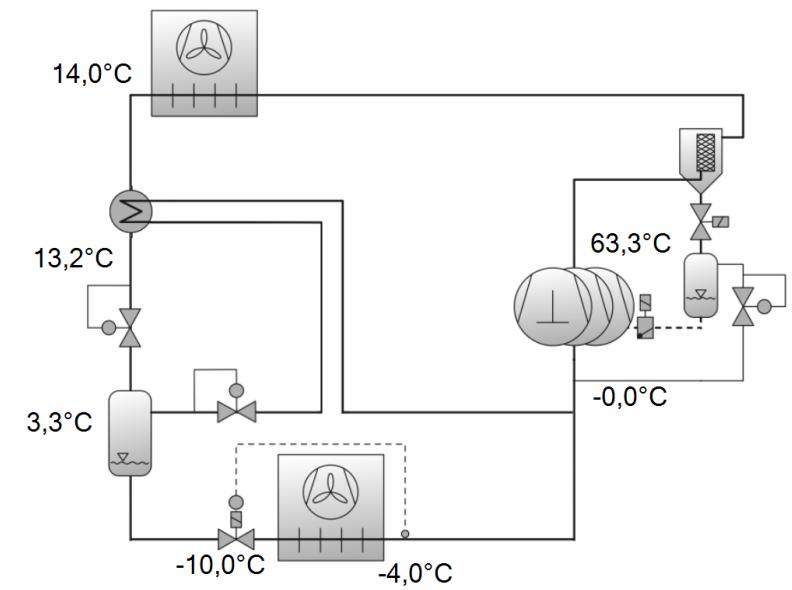
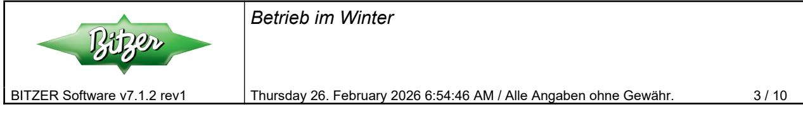
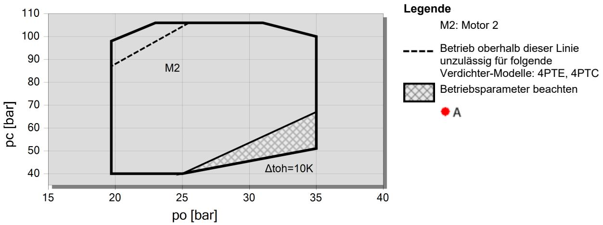
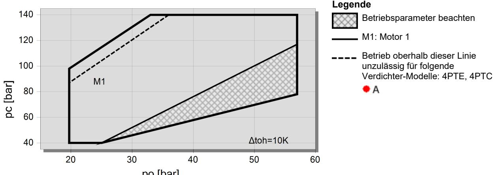
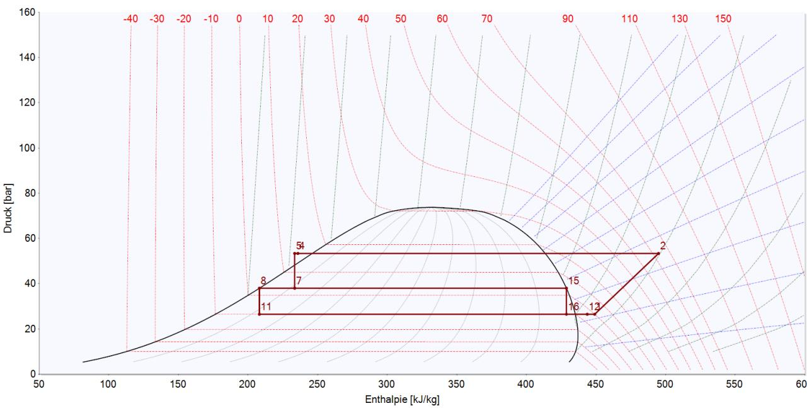
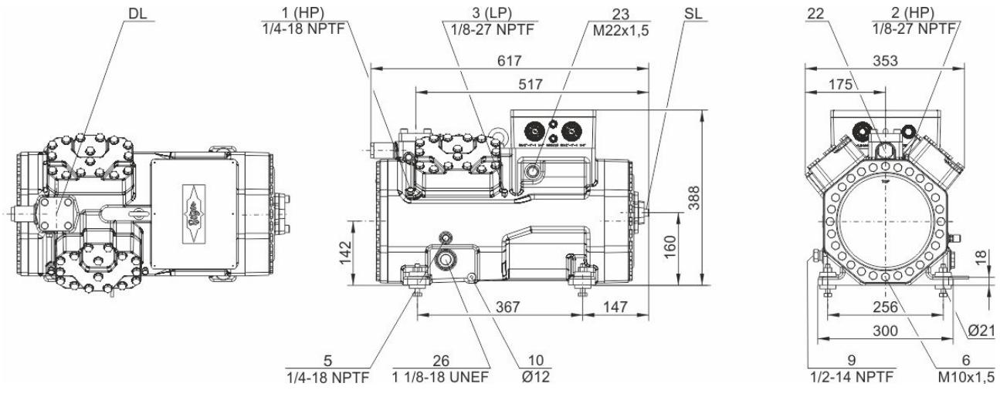
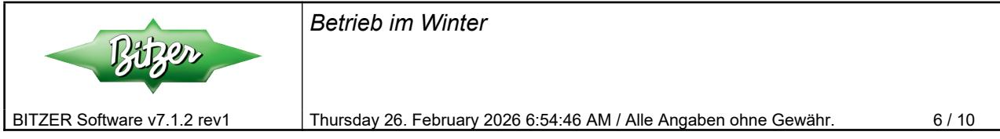
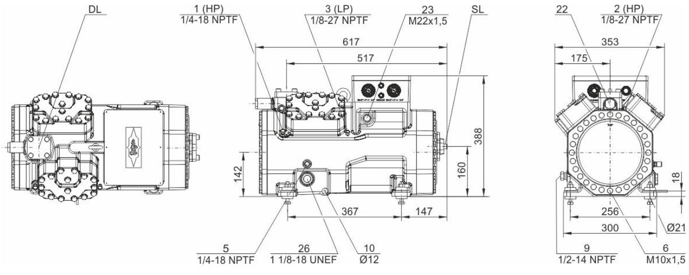

# BITZER Software v7.1.2 rev1

#### BITZER Software v7.1.2 rev1 Thursday 26. February 2026 6:54:46 AM / Alle Angaben ohne Gewähr. 1 / 10

### **Auslegung: CO2 Anlagen**

| COP/EER Verdampfer: 4,54    |                                |
|-----------------------------------|--------------------------------|
| Vorgabewerte                      | NK-Stufe                       |
| System                            | Flashgas                       |
| Baureihe                          | Standard                       |
| Betriebsart                       | Subkritisch                    |
| Anzahl Verdichter              | 3                              |
| Verdampfung                       | -10,00 °C                   |
| Verflüssigung                     | 17,00 °C                    |
| Verdampferüberhitzung             | 6,00 K                      |
| Überhitzung Saugleitung        | 4,00 K                      |
| Flüss.unterk. (nach Verfl.) | 3,00 K                      |
| Mitteldruck                       | 38,0 bar(a) / 3,30 °C |
| Netzfrequenz                      | 50Hz                           |
| Netzspannung                      | 400V                           |

BITZER Software v7.1.2 rev1 Thursday 26. February 2026 6:54:46 AM / Alle Angaben ohne Gewähr. 2 / 10

### *Ergebnis*

| Verdichter              | NN-Stufe      | 4HTE-20K   | 4HTE-15K  |
|-------------------------|---------------|------------|-----------|
| Verdichterfrequenz      | --            | 27,0       | --        |
|                         | Hz            | Hz         | Hz        |
| Verdampferleist.        | 98,9          | 19,48      | 39,7      |
|                         | kW            | kW         | kW        |
| Verflüssigermassenstrom | 1708 kg/h  | --         | --        |
| Anteil                  | --            | 19,69 % | 40,2 % |
| Verflüssigerleistung    | 122,9         | 24,2       | 49,4      |
|                         | kW            | kW         | kW        |
| Leistungsaufnahme       | 21,8          | 4,77       | 8,50      |
|                         | kW            | kW         | kW        |
| Strom                   | 49,6          | 16,94      | 16,33     |
|                         | A             | A          | A         |
| Spannungsbereich        | --            | 380-420V   | 380-420V  |
| Massenstrom             | 1708          | 336        | 686       |
|                         | kg/h          | kg/h       | kg/h      |
| Flashgas Massenstrom | 196,1 kg/h | --         | --        |
| Gesamtüberhitzung       | 10,00         | 10,00      | 10,00     |
|                         | K             | K          | K         |
| Druckgastemp.           | 63,3          | 67,4       | 62,3      |
| ungekühlt               | °C            | °C         | °C        |
| Opt. Hochdruck       | --            | --         | --        |

NK-Stufe: Vorläufige Werte.

NK-Stufe: Achtung, Betriebsparameter beachten. Siehe KP-130 oder ggf. Rücksprache mit BITZER.

NK-Stufe: Leistungsaufnahme am Verdichtereingang

NK-Stufe: Gesamtüberhitzung kleiner 10K / 18°F.

# **Einsatzgrenzen 4HTE-15K (NK-Stufe)**

# **Einsatzgrenzen 4HTE-20K (NK-Stufe)**

## **p,h Diagramm**

### **NK-Stufe**

- 2 Verdichtung
- 4 Gaskühlung/Verflüssigung
- 5 Unterkühlung durch IWT
- 7 Expansion auf Mitteldruck
- 8 Mitteldruckflasche: Flüssigkeitsaustritt
- 11 Expansion auf Verdampfungsdruck
- 12 Verdampfung
- 1 Gesamtüberhitzung
- 15 Mitteldruckflasche: Gasaustritt
- 16 Expansion auf Verdampfungsdruck

BITZER Software v7.1.2 rev1 Thursday 26. February 2026 6:54:46 AM / Alle Angaben ohne Gewähr. 5 / 10

$$5 / 10$$

# **Technische Daten: 4HTE-15K**

# **Maße und Anschlüsse**

# **Technische Daten**

| Technische Daten                    |                                                     |
|-------------------------------------|-----------------------------------------------------|
| Fördervolumen (1450/min 50Hz)       | 12.0 m³/h                                           |
| Fördervolumen (1750/min 60Hz)       | 14.5 m³/h                                           |
| Zylinderzahl x Bohrung x Hub        | 4 x 34 mm x 38 mm                                   |
| Gewicht                             | 182 kg                                              |
| Max. Überdruck                      | 100/160 bar                                         |
| Anschluss Saugleitung               | 28 mm - 1 1/8"                                      |
| Anschluss Druckleitung              | 18 mm - 3/4"                                        |
| Ölfüllung R744 (CO2)                | BSE85K (Standard), BSG68K (Option)                  |
| Motordaten                          |                                                     |
| Motorversion                        | 2                                                   |
| Motorspannung (weitere auf Anfrage) | 380-420V PW-3-50Hz                                  |
| Max. Betriebsstrom                  | 28.7 A                                              |
| Wicklungsverhältnis                 | 50/50                                               |
| Anlaufstrom (Rotor blockiert)       | 81.0 A Y / 132.0 A YY                               |
| Lieferumfang (Standard)             |                                                     |
| Motorschutz                         | SE-B3 (Option), SE-B2 (Option), CM-RC-02 (Standard) |
| Schutzart                           | IP65                                                |
| Schwingungsdämpfer                  | Standard                                            |
| Ölfüllmenge                         | 2.60 dm³                                            |
| Heizung                             | 0..140 W PTC (Standard)                             |
| Verfügbare Optionen                 |                                                     |
| Anschluss Saugleitung               | Option                                              |
| Druckabsperrventil                  | Option                                              |
| Ölinäuüberwachung                   | OLC-K1 (Option)                                     |
| Schallmessungen                     |                                                     |
| Schallleistung (-10°C / 90bar)      | 79 dB(A) @ 50Hz                                     |
| Schalldruck in 1m (-10°C / 90bar)   | 71 dB(A) @ 50Hz                                     |

BITZER Software v7.1.2 rev1 Thursday 26. February 2026 6:54:46 AM / Alle Angaben ohne Gewähr. 7 / 10

$$\frac{7}{10}$$

# **Technische Daten: 4HTE-20K**

# **Maße und Anschlüsse**

# **Technische Daten**

| Technische Daten                    | Werte                                               |
|-------------------------------------|-----------------------------------------------------|
| Fördervolumen (1450/min 50Hz)       | 12,0 m³/h                                           |
| Fördervolumen (1750/min 60Hz)       | 14,5 m³/h                                           |
| Zylinderzahl x Bohrung x Hub        | 4 x 34 mm x 38 mm                                   |
| Gewicht                             | 187 kg                                              |
| Max. Überdruck                      | 100/160 bar                                         |
| Anschluss Saugleitung               | 28 mm - 1 1/8"                                      |
| Anschluss Druckleitung              | 18 mm - 3/4"                                        |
| Ölfüllung R744 (CO2)                | BSE85K (Standard), BSG68K (Option)                  |
| Motoren Daten                       |                                                     |
| Motorversion                        | 1                                                   |
| Motorspannung (weitere auf Anfrage) | 380-420 V PW-3-50Hz                                 |
| Max. Betriebsstrom                  | 39.6 A                                              |
| Wicklungsverhältnis                 | 50/50                                               |
| Anlaufstrom (Rotor blockiert)       | 97.0 A Y / 158.0 A YY                               |
| Lieferumfang (Standard)             |                                                     |
| Motorschutz                         | SE-B3 (Option), SE-B2 (Option), CM-RC-02 (Standard) |
| Schutzart                           | IP65                                                |
| Schwingdämpfer                      | Standard                                            |
| Ölfüllmenge                         | 2,60 dm³                                            |
| Heizeinheit                         | 0..140 W PTC (Standard)                             |
| Verfügbare Optionen                 |                                                     |
| Anschluss Saugleitung               | Option                                              |
| Druckabsperrventil                  | Option                                              |
| Ölniveauüberwachung                 | OLC-K1 (Option)                                     |
| Schallmessungen                     |                                                     |
| Schallleistung (-10°C / 90bar)      | 79 dB(A) @ 50Hz                                     |
| Schalldruck in 1m (-10°C / 90bar)   | 71 dB(A) @ 50Hz                                     |

# **Berechnung von CO₂ Booster Systemen**

Die Berechnung und Auslegung von CO₂ Booster Systemen wird von vielen Faktoren beeinflusst. Die Systemkonfiguration selbst und die Betriebsbedingungen vor allem in Teillast beeinflussen die Leistungsfähigkeit des Systems und damit richtige Auswahl der Verdichter am stärksten. Im Folgenden werden Anmerkungen und Hinweise für die richtige Systemauslegung aufgeführt.

## **Flashgas Bypass Booster System**

In einem CO₂ Booster System wird das Kältemittel nach der Gaskühlung, bzw. Verflüssigung durch ein Hochdruck-Regelventil in einen Mitteldrucksammler entspannt. Im überkritischen Betrieb (ab ca. 31°C Kältemittelaustrittstemperatur) kann mit CO₂ eine Temperaturdifferenz von ca. 2 – 3K zwischen Umgebung und Kältemittelaustritt erreicht werden. Das durch die Expansion entstandene Flashgas wird über ein Druckhalteventil zur Saugleitung der NK-Verdichter abgeleitet um den Mitteldruck auf einem konstanten Niveau zu halten. Das in dem Mitteldrucksammler abgeschiedene flüssige Kältemittel wird zu den jeweiligen NK- und TK-Kühlstellen geleitet. Durch die Mitteldruckabscheidung wird der Betriebsdruck in weiten Teilen der Anlage verringert und der benötigte Kältemittelmassenstrom durch die Verdampfer gesenkt.

#### Flashgas Bypass

**CO2 Anlagen**

Das Flashgas, das durch die Entspannung in den Mitteldrucksammler entsteht, wird auf die Saugseite der NK-Verdichter geleitet um den Mitteldruck konstant zu halten. In Abhängigkeit der Druckdifferenz zwischen Mitteldrucksammler und NK-Saugdruck, kann durch die weitere Expansion Flüssigkeit aus dem Flashgas entstehen.

#### Achtung: Gefahr von Nassbetrieb des Verdichters!

Um Nassbetrieb zu vermeiden wird empfohlen, einen Flashgas Bypass Wärmeübertrager einzusetzen, der die entstandene Flüssigkeit verdampft und das Flashgas ausreichend überhitzt. Dieser Wärmeübertrager kann die benötigte Wärme von den Bereichen der Anlage nutzen, durch die ein wärmeres Kältemittel strömt, das ausreichende Kapazitäten besitzt (z.B. flüssiges Kältemittel aus dem Mitteldrucksammler oder dem Gaskühler Austritt. Achtung – Die Patentsituation solcher Verschaltungen muss geprüft werden).

#### Mischpunkt

Auf der Saugseite der NK-Verdichter treffen drei unterschiedliche Kältemittelmassenströme zusammen und werden zu einem Sauggasmassenstrom vereint.

- \* Abgeleitetes Flash Gas aus dem Mitteldrucksammler
- \* Druckgas aus den TK-Verdichtern
- \* überhitztes Gas aus den NK-Verdampfern

Durch die Mischung dieser Massenströme kann, je nach Lastverhältnis des Systems (NK-Last / TK-Last), der Umgebungstemperatur (Menge an entstandenem Flashgas) und dem Mitteldruck Niveau (Menge an verflüssigtem Flashgas) eine zu hohe oder zu geringe Gesamtüberhitzung entstehen. Daher ist es zwingend Notwendig, das Verhalten bei Teillast in der NK-Stufe, sowie in der TK-Stufe und bei geringer Umgebungstemperatur zu untersuchen.

Szenario 1: Geringe NK-Last, hohe TK-Last, geringe Umgebungstemperatur

\* Geringe Umgebungstemperatur: wenig Flashgas entsteht – weniger "kaltes" Flashgas am Mischpunkt

- \* Geringe NK-Last: weniger "kaltes" Gas aus den NK-Verdampfern
- \* Hohe TK-Last: viel "heißes" Druckgas aus den TK-Verdichtern
- → Erhöhte Sauggastemperatur

→ Motorkühlung kann bei zu starker überhitzung nicht ausreichend gewährleistet werden. Die Gesamtüberhitzung des Sauggases sollte nicht überschritten werden (max. 40 K; VARISPEED: 20 K). Ein Druckgasenthitzer des TK-Druckgases schafft bei zu starker Überhitzung Abhilfe.

Szenario 2: Hohe NK-Last, geringe TK-Last, hohe Umgebungstemperatur

\* Hohe Umgebungstemperatur: viel Flashgas entsteht – mehr "kaltes" Gas am Mischpunkt (verflüssigtes Flashgas muss vor dem Mischpunkt verdampft werden)

- \* Hohe NK-Last: viel "kaltes" Gas aus den NK-Verdampfern
- \* Geringe TK-Last: wenig "heißes" Druckgas aus den TK-Verdichtern
- → Geringe Sauggasüberhitzung Gefahr von Nassbetrieb

→ Nassbetrieb über einen längeren Zeitraum kann zu Schädigungen am Verdichter führen (geringe Öltemperatur,

Schaumbildung, Ölauswaschung, Flüssigkeitsschläge, höhere mechanische Belastung). Es muss sichergestellt werden, dass die Gesamtüberhitzung des Sauggases nicht zu gering ist (min. 10 K). Ein Flashgas Wärmeübertrager und eine geringe Druckdifferenz zwischen Mitteldrucksammler und NK-Saugdruck werden empfohlen.

Szenario 3: Geringe NK-Last, geringe TK-Last, geringe Umgebungstemperatur (Winterbetrieb)

\* Geringe Last auf beiden Stufen (Nachtbetrieb, Winter)

→ An-/Aus Betrieb reduziert die Systemstabilität und erhöht den Verschleiß

→ Die Verdichter sollten auch für den geringsten möglichen Lastfall so ausgelegt werden, dass pro Stufe mindestens ein Verdichter durchgehend arbeiten kann.

### **Verdichterauswahl**

Die Verdichter können manuell oder automatisch von der Software ausgewählt werden. Generell wird pro Verdichterstufe ein Verdichter mit Frequenzumrichter betrieben (Auswahl eines VARIPACK oder VARISPEED). Für einen störungsfreien Betrieb durch eine stufenlose Lastanpassung wird empfohlen, den Inverter geregelten Verdichter so auszuwählen, dass das Fördervolumen zwischen der minimal- und maximal möglichen Drehzahl in einem ähnlichen Bereich wie das Fördervolumen der nächsten nicht Inverter betriebenen Verdichtern liegt. Dadurch wird die Lücke beim Abschalten eines Verdichters in Teillast ausreichen kompensiert. Ebenso hilft die Auswahl unterschiedlicher Verdichtergrößen bei der optimalen Lastanpassung. Es wird empfohlen, eine ausreichend große Anzahl an Verdichtern zu wählen, um auch den geringsten Lastbedarf durch kontinuierlichen Betrieb eines Verdichters pro Stufe abzudecken.

Die in der Software gezeigten Einsatzgrenzen sind für den Netzbetrieb bei 10K Überhitzung für NK-Verdichter und 20K Überhitzung für TK-Verdichter gültig. Die Gesamtüberhitzung jeder Stufe sollte innerhalb der Grenzen (10 K – 40K, VARISPEED: 20K) liegen. Eine zu hohe Überhitzung oder der Einsatz von Frequenzumrichtern können diese Grenzen einschränken. Limitationen durch den Einsatz eines VARIPACK oder VARISPEED Verdichters können unter dem Menüpunkt "Zubehör" eingesehen werden.

Durch oftmals geringe Druckverhältnisse zwischen TK- und NK-Stufe wird empfohlen, einen internen Wärmeübertrager zwischen TK-Sauggas und TK-Flüssigkeitsleitung einzusetzen um die Druckgas- und Öltemperatur der TK-Verdichter anzuheben. Dies ist auch eine Maßnahme um den Verdichter vor Nassbetrieb durch starke Lastschwankungen, Flüssigkeitsdurchschlag bei Heißgasabtauung oder defekten Expansionsventilen zu schützen.

## **Ölmanagement**

Verbundanlagen sind üblicherweise mit einem aktiven Ölmanagementsystem ausgerüstet. Dieses besteht aus Hochdruck-Ölabscheider, Niederdruck-Ölreservoir und Ölspiegelregulatoren an den einzelnen Verdichter um hohe Betriebssicherheit zu gewährleisten.

Bitte beachten Sie die besonderen Anforderungen bei der Ölversorgung und -verteilung, bei Anlagen mit mehr als 6 Verdichtern pro Stufe. Zu beachten ist die Dimensionierung der Ölrückführungsleitung. Speziell erhöhter Druckverlust ist zu vermeiden, da sich Entgasungseffekte negativ auf die Öleinspeisung in die Verdichter auswirken können. Horizontale Ausrichtung des Sauggaskollektors muss sichergestellt sein. Rücksprache mit BITZER wird empfohlen.

Weitere Informationen zur Auslegung und dem sicheren Betrieb von transkritischen CO₂ Systemen können den Dokumentationen KB-130, KP-130 und den Veröffentlichungen Auslegung, Berechnung und Simulation von Booster-Kälteanlagen mit CO₂ als Kältemittel und Betriebsverhalten von CO₂-Booster-Systemen entnommen werden. BITZER bietet weiterhin ausführliche Schulungen für die Auslegung und den Betrieb von sub- und transkritische CO₂ Systemen an.